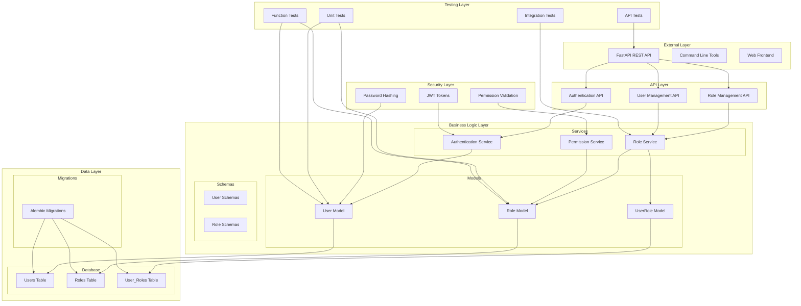

# Role System Architecture Diagram

## System Overview

This document provides a comprehensive architecture diagram and file structure overview for the Role-Based Access Control (RBAC) system.

## Architecture Diagram



## File Structure and Responsibilities

### 📁 Core Models (`app/models/`)

#### `user.py` - User Model
- **Purpose**: Extends FastAPI-Users with role integration
- **Key Features**:
  - UUID-based primary key
  - Profile management (first_name, last_name, phone, bio)
  - Role relationship management
  - Helper methods for role checking
  - Serialization support

#### `role.py` - Role Model
- **Purpose**: Defines roles with permission management
- **Key Features**:
  - JSON-based permission storage
  - Permission validation and management
  - Active/inactive status
  - Audit trails (created_at, updated_at)

#### `user_role.py` - Association Model
- **Purpose**: Many-to-many relationship between User and Role
- **Key Features**:
  - Assignment tracking (assigned_at, assigned_by)
  - Active/inactive assignments
  - Cascade delete support

### 📁 API Layer (`app/api/`)

#### `auth.py` - Authentication API
- **Purpose**: User authentication and authorization
- **Endpoints**:
  - Login/logout
  - Token management
  - Password reset

#### `roles.py` - Role Management API
- **Purpose**: Complete role CRUD operations
- **Endpoints**:
  - Create, read, update, delete roles
  - Assign/remove roles from users
  - Role statistics and reporting
  - Permission management

#### `users.py` - User Management API
- **Purpose**: User profile management
- **Endpoints**:
  - User CRUD operations
  - Profile management
  - Role assignments

### 📁 Data Layer (`app/db/`)

#### `database.py` - Database Configuration
- **Purpose**: SQLAlchemy async engine and session management
- **Features**:
  - Async session factory
  - Database initialization
  - Connection management

### 📁 Schemas (`app/schemas/`)

#### `user.py` - User Schemas
- **Purpose**: Pydantic models for user data validation
- **Schemas**:
  - UserCreate, UserUpdate, UserRead
  - UserProfile, UserLoginRequest

#### `role.py` - Role Schemas
- **Purpose**: Pydantic models for role data validation
- **Schemas**:
  - RoleCreate, RoleUpdate, RoleRead
  - UserRoleAssignment, RoleStatistics

### 📁 Security (`app/core/`)

#### `security.py` - Security Utilities
- **Purpose**: Authentication and authorization utilities
- **Features**:
  - Password hashing
  - JWT token management
  - Permission validation

### 📁 Testing (`tests/`)

#### `unit/` - Unit Tests
- **Purpose**: Test individual model methods
- **Files**:
  - `test_roles_simple.py` - Basic role tests
  - `test_user_roles.py` - User-role relationship tests

#### `api/` - API Tests
- **Purpose**: Test API endpoints
- **Files**:
  - `test_role_api.py` - Role API endpoint tests

#### `integration/` - Integration Tests
- **Purpose**: Test complete workflows
- **Files**:
  - `test_role_integration.py` - End-to-end role management

#### `security/` - Security Tests
- **Purpose**: Test security features
- **Files**:
  - `test_role_security.py` - Permission and access control tests

#### `performance/` - Performance Tests
- **Purpose**: Test system performance
- **Files**:
  - `test_role_performance.py` - Load and performance tests

### 📁 Test Scripts (Root Level)

#### `comprehensive_test.py` - Comprehensive Test Suite
- **Purpose**: Exhaustive testing of all features
- **Features**:
  - CRUD operations testing
  - Permission management testing
  - Error handling testing
  - Performance testing

#### `function_test_scripts.py` - Individual Function Tests
- **Purpose**: Test specific functions and features
- **Usage**: `python function_test_scripts.py [test_name]`
- **Available Tests**:
  - `role_crud` - Role CRUD operations
  - `user_crud` - User CRUD operations
  - `permissions` - Permission management
  - `assignments` - User-role assignments
  - `queries` - Complex queries
  - `serialization` - Data serialization

#### `simple_test.py` - Simple Test Script
- **Purpose**: Quick testing with existing data
- **Features**:
  - Works with existing database
  - No data conflicts
  - Quick validation

#### `demo_role_system.py` - Interactive Demo
- **Purpose**: Educational demonstration
- **Features**:
  - Step-by-step role management
  - Visual output
  - Handles existing data

### 📁 Database Migrations (`alembic/`)

#### `versions/` - Migration Files
- **Purpose**: Database schema versioning
- **Files**:
  - `f6f4914742e2_initial_migration_create_all_tables.py`
  - `4f2bed31f0e2_add_is_active_column_to_user_roles.py`

## Data Flow

### 1. User Authentication Flow
```
User Login → Auth API → Security Service → User Model → Database
```

### 2. Role Assignment Flow
```
Admin Request → Role API → Role Service → UserRole Model → Database
```

### 3. Permission Check Flow
```
User Action → Permission Service → Role Model → Permission Validation
```

### 4. Data Retrieval Flow
```
API Request → Service Layer → Model Layer → Database → Serialization
```

## Key Features

### 🔐 Security Features
- JWT-based authentication
- Password hashing with bcrypt
- Role-based access control
- Permission validation
- SQL injection protection

### 📊 Data Management
- Async SQLAlchemy ORM
- Database migrations with Alembic
- JSON-based permission storage
- Audit trails
- Cascade deletes

### 🧪 Testing Coverage
- Unit tests for all models
- Integration tests for workflows
- API tests for endpoints
- Performance tests for scalability
- Security tests for access control

### 🚀 Performance Features
- Async database operations
- Efficient query optimization
- Lazy loading for relationships
- Bulk operations support
- Connection pooling

## Usage Examples

### Quick Start
```bash
# Run simple test
python simple_test.py

# Run comprehensive test
python comprehensive_test.py

# Run specific function test
python function_test_scripts.py role_crud

# Start API server
python -m uvicorn app.main:app --reload
```

### API Usage
```bash
# Test API endpoints
./test_api.sh

# Seed test data
python seed_test_data.py
```

This architecture provides a robust, scalable, and maintainable role-based access control system with comprehensive testing and documentation.
