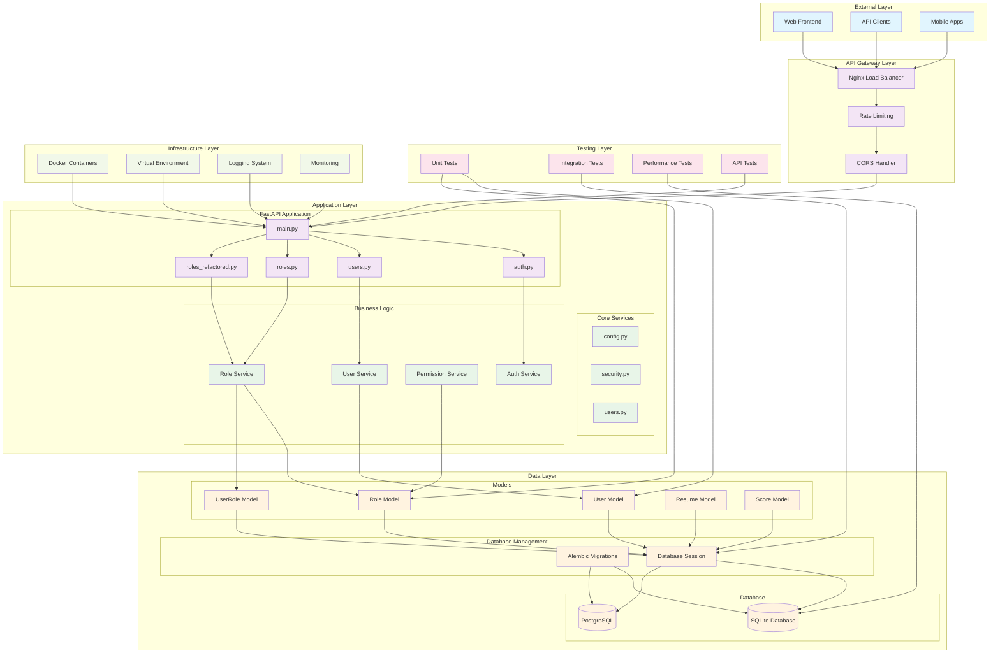

# AI Job Readiness Platform - System Architecture Diagram

## Overview
This document provides a comprehensive visual representation of the AI Job Readiness Platform's system architecture, showing the relationships between different components, data flow, and system interactions.

## System Architecture Diagram



## Component Relationships

### 1. External Layer
- **Web Frontend**: React-based user interface
- **API Clients**: Third-party integrations and mobile apps
- **Mobile Apps**: Native mobile applications

### 2. API Gateway Layer
- **Nginx Load Balancer**: Handles traffic distribution and SSL termination
- **Rate Limiting**: Prevents API abuse and ensures fair usage
- **CORS Handler**: Manages cross-origin resource sharing

### 3. Application Layer

#### FastAPI Application
- **main.py**: Main application entry point and router configuration
- **auth.py**: Authentication endpoints and JWT token management
- **users.py**: User management endpoints
- **roles.py**: Role management endpoints (original)
- **roles_refactored.py**: Enhanced role management endpoints

#### Core Services
- **config.py**: Application configuration and environment management
- **security.py**: Security utilities and password hashing
- **users.py**: User-related business logic

#### Business Logic
- **User Service**: User management and profile operations
- **Role Service**: Role-based access control management
- **Permission Service**: Permission validation and management
- **Auth Service**: Authentication and authorization logic

### 4. Data Layer

#### Models
- **User Model**: User entity with profile information and relationships
- **Role Model**: Role entity with permissions and metadata
- **UserRole Model**: Many-to-many association between users and roles
- **Resume Model**: Resume storage and management
- **Score Model**: AI analysis scores and recommendations

#### Database
- **SQLite**: Development and testing database
- **PostgreSQL**: Production database for scalability

#### Database Management
- **Alembic Migrations**: Database schema versioning and migrations
- **Database Session**: SQLAlchemy session management

### 5. Testing Layer
- **Unit Tests**: Individual component testing
- **Integration Tests**: Cross-component testing
- **Performance Tests**: Load and stress testing
- **API Tests**: Endpoint testing and validation

### 6. Infrastructure Layer
- **Docker Containers**: Containerized deployment
- **Virtual Environment**: Python dependency isolation
- **Logging System**: Application logging and monitoring
- **Monitoring**: System health and performance monitoring

## Data Flow

### 1. Request Flow
1. External clients send requests to the API Gateway
2. Nginx handles load balancing and SSL termination
3. Rate limiting and CORS policies are applied
4. Requests are routed to appropriate FastAPI endpoints
5. Business logic services process the requests
6. Data models interact with the database
7. Responses are returned through the same path

### 2. Authentication Flow
1. User credentials are validated through the Auth Service
2. JWT tokens are generated and returned
3. Subsequent requests include JWT tokens for authorization
4. Role and permission services validate access rights
5. Database queries are executed based on user permissions

### 3. Database Operations
1. SQLAlchemy ORM models define the data structure
2. Database sessions manage connections and transactions
3. Alembic handles schema migrations and versioning
4. Queries are optimized with proper indexing and eager loading

## Key Features

### 1. Scalability
- Horizontal scaling through load balancing
- Database connection pooling
- Caching strategies for frequently accessed data
- Optimized queries with proper indexing

### 2. Security
- JWT-based authentication
- Role-based access control (RBAC)
- Input validation and sanitization
- Rate limiting and CORS protection

### 3. Maintainability
- Modular architecture with clear separation of concerns
- Comprehensive testing coverage
- Database migrations for schema changes
- Logging and monitoring for debugging

### 4. Performance
- Optimized database queries
- Eager loading for relationships
- Connection pooling
- Caching strategies

## File Structure

```
backend/
├── app/
│   ├── api/
│   │   ├── auth.py
│   │   ├── users.py
│   │   ├── roles.py
│   │   └── roles_refactored.py
│   ├── core/
│   │   ├── config.py
│   │   ├── security.py
│   │   └── users.py
│   ├── db/
│   │   └── database.py
│   ├── models/
│   │   ├── user.py
│   │   ├── role.py
│   │   ├── user_refactored.py
│   │   ├── role_refactored.py
│   │   ├── resume.py
│   │   └── score.py
│   ├── schemas/
│   │   ├── user.py
│   │   └── role.py
│   └── main.py
├── alembic/
│   └── versions/
├── tests/
│   ├── unit/
│   ├── integration/
│   ├── performance/
│   └── api/
└── requirements.txt
```

## Technology Stack

- **Backend**: FastAPI, Python 3.8+
- **Database**: SQLite (dev), PostgreSQL (prod)
- **ORM**: SQLAlchemy with async support
- **Authentication**: JWT tokens with FastAPI-Users
- **Migrations**: Alembic
- **Testing**: Pytest with async support
- **Containerization**: Docker
- **Load Balancing**: Nginx
- **Monitoring**: Built-in logging and health checks

## Performance Optimizations

1. **Database Level**
   - Proper indexing on frequently queried columns
   - Eager loading for relationships to prevent N+1 queries
   - Connection pooling for database connections
   - Query optimization with selectinload and joinedload

2. **Application Level**
   - Async/await for non-blocking operations
   - Caching for frequently accessed data
   - Pagination for large datasets
   - Input validation to prevent unnecessary processing

3. **Infrastructure Level**
   - Load balancing for horizontal scaling
   - Rate limiting to prevent abuse
   - CORS handling for cross-origin requests
   - Health checks for monitoring

This architecture provides a robust, scalable, and maintainable foundation for the AI Job Readiness Platform while ensuring security, performance, and ease of development.
